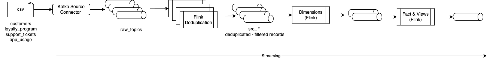
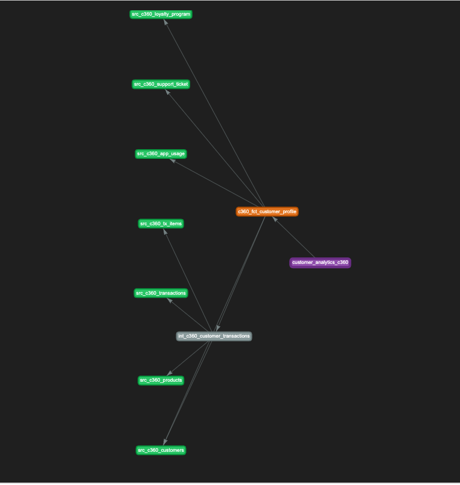

# Customer 360 profile with Flink

This is the Flink implementation of the customer 360 analytics data product. It was created by using the shift_left tool to automatically migrate the Spark SQL batch processing to a real-time Flink SQL based processing. 

The goal of this asset is to demonstrate how a shift left project looks like, how to manage a Flink project and how to design Data analytics as a product.

At the high level a medallion structure done in Flink will loop the same as in the following figure:



This project was created mid 2025 to demonstrate the Customer 360 profile data analytic product, specially:

* Loyalty program statistic
* Support metrics
* Transaction metrics
* App usage metrics
* The RFM-like scoring

The data model and pipeline design match the Spark Processing. See [the data model section.](https://jbcodeforce.github.io/flink_project_demos/c360/data_models/)

Starting 2026, we are adding other data products to illustrate how to manage different data product and reuse existing dimensions or facts, cross product. The shipment data analytics is added under the product name: `sdp`. The following metrics are considered:

* actual_delivery_date deviation for expected delivery date
* number of time the ETA estimations were wrong
* average shipping cost
* shipping per customer segment
* sla violation metric


## How to run this demonstration

* First create the source tables using terraform to simulate CDC topics and prepare some test data
  ```sh
  cd IaC
  mv terraform.tfvars.example terraform.tfvars
  # modify the variable settings inside terraform.tfvars with your Confluent Cloud existing resources
  terraform init
  terraform plan
  terraform deploy
  ```

* Use the shift_left utility to deploy the solution. Be sure to export the environment variables for PIPELINES and CONFIG_FILE
  ```sh
  source set_env
  shift_left project validate-config

  shift_left table build-inventory

  shift_left pipeline build-all-metadata
  ```

* Verify the customer 360 view dependency graph
  ```sh
  shift_left pipeline report customer_analytics_c360 --open
  ```



* Verify the shipment  analytics data product
  ```
  pipeline report sdp_fulfillment_analytics --open
  ```

* Validate the execution plan for the customer 360 data product 
  ```sh
  shift_left pipeline build-execution-plan --product-name c360
  ```

* Deploy
  ```sh
  shift_left pipeline deploy --product-name c360
  ```

* The expected results look like:
  ```sh
  --------------------------------------------------------------------------------------------------------
  Table_name                                              | Status     | Pending Records | Num Records Out
  --------------------------------------------------------------------------------------------------------
  src_c360_support_ticket                                 | RUNNING    |               0 |              18
  src_c360_loyalty_program                                | RUNNING    |               0 |              15
  src_c360_customers                                      | RUNNING    |               0 |              16
  src_c360_app_usage                                      | RUNNING    |               0 |              20
  src_c360_transactions                                   | RUNNING    |               0 |              20
  src_c360_tx_items                                       | RUNNING    |               0 |               0
  src_c360_products                                       | RUNNING    |               0 |               0
  src_c360_shipments                                      | RUNNING    |               0 |              20
  src_c360_tracking_events                                | RUNNING    |               0 |              30
  int_c360_customer_transactions                          | RUNNING    |               0 |               0
  dim_c360_order_fulfillment                              | RUNNING    |               0 |              20
  c360_fct_customer_profile                               | RUNNING    |               0 |              27
  c360_fct_order_fulfillment                              | RUNNING    |               0 |              20
  customer_analytics_c360                                 | RUNNING    |               0 |               3
  fulfillment_analytics_c360                              | RUNNING    |               0 |              20
  --------------------------------------------------------------------------------------------------------
  ```

* In the Flink Workspace, `select * from c360_fct_customer_profile` returns customer 360 records; `select * from fulfillment_analytics_c360` returns fulfillment and delivery analytics.


## Pipeline Tables

This section lists all DDL (Data Definition Language) and DML (Data Manipulation Language) files organized by data layer.

### Raw Tables

| Table Name | DDL File | Insert | Data |
|---------------|-------|--------|------|
| customers_raw | ok | ok |  15 records |
| product_raw   | ok | ok | 36 rows |
| tx_raw        | ok | ok | 20 rows |
| transaction_items_raw | ok | ok | 25 rows |
| app_usage_raw | ok | ok | 20 rows |
| support_ticket_raw | ok | ok | 18 rows |
| loyalty_program_raw | ok | ok | 15 rows |
| shipments_raw | ok | ok | 20 rows |
| tracking_events_raw | ok | ok | 30 rows |

### Source Layer Tables

| Table Name | DDL File | DML File | Deployment | Data Visibility |
|-----------|----------|----------|------------|-----------------|
| `src_c360_customers` | `ddl.src_c360_customers.sql` | `dml.src_c360_customers.sql` | Deploy first - no dependencies | Immediate after Kafka topic has data |
| `src_c360_products` | `ddl.src_c360_products.sql` | `dml.src_c360_products.sql` | Deploy first - no dependencies | Immediate after Kafka topic has data |
| `src_c360_transactions` | `ddl.src_c360_transactions.sql` | `dml.src_c360_transactions.sql` | Deploy first - no dependencies | Immediate after Kafka topic has data |
| `src_c360_tx_items` | `ddl.src_c360_tx_items.sql` | `dml.src_c360_tx_items.sql` | Deploy first - no dependencies | Immediate after Kafka topic has data |
| `src_c360_app_usage` | `ddl.src_c360_app_usage.sql` | `dml.src_c360_app_usage.sql` | Deploy first - no dependencies | Immediate after Kafka topic has data |
| `src_c360_support_ticket` | `ddl.src_c360_support_ticket.sql` | `dml.src_c360_support_ticket.sql` | Deploy first - no dependencies | Immediate after Kafka topic has data |
| `src_c360_loyalty_program` | `ddl.src_c360_loyalty_program.sql` | `dml.src_c360_loyalty_program.sql` | Deploy first - no dependencies | Immediate after Kafka topic has data |
| `src_c360_shipments` | `ddl.src_c360_shipments.sql` | `dml.src_c360_shipments.sql` | Deploy first - no dependencies | Immediate after Kafka topic has data |
| `src_c360_tracking_events` | `ddl.src_c360_tracking_events.sql` | `dml.src_c360_tracking_events.sql` | Deploy first - no dependencies | Immediate after Kafka topic has data |

### Intermediate Layer Tables

| Table Name | DDL File | DML File | Deployment | Data Visibility |
|-----------|----------|----------|------------|-----------------|
| `int_c360_customer_transactions` | `ddl.int_c360_customer_transactions.sql` | `dml.int_c360_customer_transactions.sql` | After sources | 15 records |
| `dim_c360_order_fulfillment` | `ddl.int_c360_order_fulfillment.sql` | `dml.int_c360_order_fulfillment.sql` | After src_c360_shipments, src_c360_transactions | One row per shipment |

### Fact Layer Tables

| Table Name | DDL File | DML File | Deployment | Data Visibility |
|-----------|----------|----------|------------|-----------------|
| `c360_fct_customer_profile` | `ddl.c360_fct_customer_profile.sql` | `dml.c360_fct_customer_profile.sql` | Deploy after intermediate and source tables | After all upstream dependencies have data |
| `c360_fct_order_fulfillment` | `ddl.c360_fct_order_fulfillment.sql` | `dml.c360_fct_order_fulfillment.sql` | Deploy after dim_c360_order_fulfillment and src_c360_customers | One row per shipment |

### View Tables

| Table Name | DDL File | DML File | Deployment | Data Visibility |
|-----------|----------|----------|------------|-----------------|
| `customer_analytics_c360` | `ddl.customer_analytics_c360.sql` | `dml.customer_analytics_c360.sql` | After c360_fct_customer_profile | Customer 360 profile for CRM/BI |
| `fulfillment_analytics_c360` | `ddl.fulfillment_analytics_c360.sql` | `dml.fulfillment_analytics_c360.sql` | After c360_fct_order_fulfillment | Fulfillment and delivery analytics for ops |

## Deployment Order

1. **Source Layer**: Deploy all source tables in parallel (no dependencies on each other), including `src_c360_shipments` and `src_c360_tracking_events` for the fulfillment product
2. **Intermediate / Dimension Layer**: Deploy `int_c360_customer_transactions` and `dim_c360_order_fulfillment` after source tables are running
3. **Fact Layer**: Deploy `c360_fct_customer_profile` and `c360_fct_order_fulfillment` after their dimension/source dependencies
4. **View Layer**: Deploy `customer_analytics_c360` and `fulfillment_analytics_c360` after their fact tables

## Dashboard data

Parquet snapshots of the analytics views (`customer_analytics_c360`, `sdp_fulfillment_analytics`) are available under [dashboard_data/](dashboard_data/) for building a dashboard with DuckDB. Generate sample parquet with `scripts/export_views_to_parquet.py` and query with DuckDB; see [dashboard_data/README.md](dashboard_data/README.md) for layout, usage, and optional Kafka export or Iceberg.

## Data Visibility Notes

- **DDL**: Creates table schema, Kafka topics, and metadata
- **DML**: Creates Flink SQL streaming jobs that continuously process data
- **Data Visibility**: Time from job start until data appears in the table depends on:
  - Upstream data availability
  - Kafka topic backlog
  - Flink checkpoint intervals
  - Processing watermarks and windowing logic

