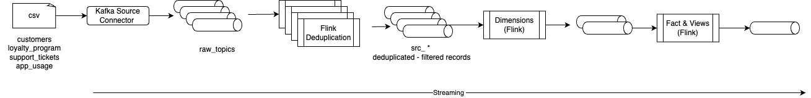

# Customer 360 Flink Implementation

The Flink implementation is using the same approach as the spark implementation. The sources of data are now becoming streams, and to support the Stream capability we use Apache Kafka.

This chapter proposes different approaches to implement the Flink SQL queries, one starting from a white page but using the [shift Left Data Engineer's recipes](https://jbcodeforce.github.io/shift_left_utils/recipes/#data-engineer-centric-use-cases). And one using AI to migrate from the Spark batch processing.

## Final architecture

The high level view of a star schema implementation with Flink looks like a set of statements and Kafka topics like in the following diagram:



The current approach for pure Confluent Cloud deployment the raw topics and raw data are created using SQL in the tests folder of each src_* tables.

The final pipeline looks like in the following diagram and the consitency of the pipeline deployment is done with the shift_left tool:


## Building the project

This section presents the commands executed to build the `c360_flink_processing` project, and all its content.

### Define the shift_left utils configuration

As the project uses the [shift_left utils](https://jbcodeforce.github.io/shift_left_utils/setup/) to define the project structure, the different tables, the pipelines, and the deployment, we need to do some configuration:

* Create a config.yaml from the template, and .gitignore it
* create a .env to export all the environment variables and .gitignore it
* source the .env
* Run: `shift_left project validate-config` -> should get "Config.yaml validated" message

### Create the target project

It will create a `customer_360/c360_flink_processing` folder

```sql
shift_left project init c360_flink_processing customer_360
```

SQL files are organized into layers based on data processing stage:

```sh
sources/          → Load raw data
dimensions/       → Reference tables
intermediates/    → Transformations
facts/            → Aggregations
views/            → Final products
```

### Add table foundations

* Create the **fct_customer_360_profile**
    ```sh
    shift_left table init fct_customer_360_profile $PIPELINES/facts --product-name c360
    ```

    It should build the following structure:
    ```sh
    └── c360
        └── fct_customer_360_profile
            ├── Makefile
            ├── sql-scripts
            │   ├── ddl.c360_fct_customer_360_profile.sql
            │   └── dml.c360_fct_customer_360_profile.sql
            ├── tests
            └── tracking.md
    ```

    The DDL is created by looking as the expected structure in the corresponding Spark fct_customer_360_profile.sql

The fact needs source tables to get the data from raw topics.

* Create  `src_loyalty_program` with the command:
    ```sql
    shift_left table init src_loyalty_program $PIPELINES/sources --product-name c360
    ```

* Other sources to create
    ```sh
    shift_left table init src_customers  $PIPELINES/sources --product-name c360
    shift_left table init src_app_usage  $PIPELINES/sources --product-name c360
    shift_left table init src_support_ticket  $PIPELINES/sources --product-name c360
    shift_left table init src_tx_items  $PIPELINES/sources --product-name c360
    ```
* Each dml may implement the deduplication pattern.
    ```sql
    insert into ..
    select 
    ...
    FROM (
        SELECT *,
            ROW_NUMBER() OVER (
                PARTITION BY ticket_id 
                ORDER BY `$rowtime` DESC
            ) AS row_num
        FROM support_ticket_raw
    ) WHERE row_num = 1
    ```
* for each sources add the creation of the raw tables, and the insert statements to get some values into the raw kafka topics. Use the following prompt to the AI code assistant:
    ```txt
    create a flink sql to insert the same records from the @support_tickets.csv into a support_ticket_raw
    ```
### Add an intermediate table for the transaction

```sh
shift_left table init int_customer_transactions  $PIPELINES/intermediates --product-name c360
```

which leads to create new srcs and raws
```sh
shift_left table init src_tx_items  $PIPELINES/sources --product-name c360
shift_left table init src_transactions  $PIPELINES/sources --product-name c360 
shift_left table init src_products  $PIPELINES/sources --product-name c360
```

One of the prompt is:
```
create a flink sql to insert the same records from the @transaction_items.csv into insert transaction_items_raw
```

At that stage the files and folders constructed are (removing Makefile and tracking.md):
```
├── dimensions
├── facts
│   └── c360
│       └── fct_customer_360_profile
│           ├── sql-scripts
│           │   ├── ddl.c360_fct_customer_profile.sql
│           │   └── dml.c360_fct_customer_profile.sql
│           ├── tests
├── intermediates
│   └── c360
│       └── int_customer_transactions
│           ├── sql-scripts
│           │   ├── ddl.int_c360_customer_transactions.sql
│           │   └── dml.int_c360_customer_transactions.sql
│           ├── tests
├── sources
│   └── c360
│       ├── src_app_usage
│       │   ├── sql-scripts
│       │   │   ├── ddl.src_c360_app_usage.sql
│       │   │   └── dml.src_c360_app_usage.sql
│       │   ├── tests
│       │   │   ├── ddl.app_usage_raw.sql
│       │   │   └── insert_app_usage_raw.sql
│       ├── src_customers
│       │   ├── sql-scripts
│       │   │   ├── ddl.src_c360_customers.sql
│       │   │   └── dml.src_c360_customers.sql
│       │   ├── tests
│       │   │   ├── ddl.customers_raw.sql
│       │   │   └── insert_customers_raw.sql
│       ├── src_loyalty_program
│       │   ├── sql-scripts
│       │   │   ├── ddl.src_c360_loyalty_program.sql
│       │   │   └── dml.src_c360_loyalty_program.sql
│       │   ├── tests
│       │   │   ├── ddl.loyalty_program_raw.sql
│       │   │   └── insert_loyalty_program_raw.sql
│       ├── src_products
│       │   ├── sql-scripts
│       │   │   ├── ddl.src_c360_products.sql
│       │   │   └── dml.src_c360_products.sql
│       │   ├── tests
│       │   │   ├── ddl.product_raw.sql
│       │   │   └── insert_product_raw.sql
│       ├── src_support_ticket
│       │   ├── sql-scripts
│       │   │   ├── ddl.src_c360_support_ticket.sql
│       │   │   └── dml.src_c360_support_ticket.sql
│       │   ├── tests
│       │   │   ├── ddl.support_ticket_raw.sql
│       │   │   └── insert_support_ticket_raw.sql
│       ├── src_transactions
│       │   ├── sql-scripts
│       │   │   ├── ddl.src_c360_transactions.sql
│       │   │   └── dml.src_c360_transactions.sql
│       │   ├── tests
│       │   │   ├── ddl.tx_raw.sql
│       │   │   └── insert_tx_raw.sql
│       └── src_tx_items
│           ├── sql-scripts
│           │   ├── ddl.src_c360_tx_items.sql
│           │   └── dml.src_c360_tx_items.sql
│           ├── tests
│           │   ├── ddl.tx_items_raw.sql
│           │   └── insert_tx_items_raw.sql
```

### Build the views as gold layer

```sh
shift_left table init customer_analytics_c360 $PIPELINES/views --product-name c360
```

The tree is now:

```
views
└── c360
    └── customer_analytics_c360
        ├── sql-scripts
        │   ├── ddl.customer_analytics_c360.sql
        │   └── dml.customer_analytics_c360.sql
        ├── tests
```

[See the views/c360/customer_analytics_c360/sql-scripts/dml.customer_analytics_c360.sql](https://github.com/jbcodeforce/flink_project_demos/blob/main/customer_360/c360_flink_processing/pipelines/views/c360/customer_analytics_c360/sql-scripts/dml.customer_analytics_c360.sql)

### Finalize the Fact tables

This is mostly to verify the column types and the logic of the dml that matches the Spark SQL. [See the facts/c360/fct_customer_360_profile/sql-scripts/dml.c360_fct_customer_profile.sql](https://github.com/jbcodeforce/flink_project_demos/blob/main/customer_360/c360_flink_processing/pipelines/facts/c360/fct_customer_360_profile/sql-scripts/dml.c360_fct_customer_profile.sql)

## Using Shift_left tools to manage the pipeline

1. Build the table inventory
    ```sh
    shift_left table build-inventory
    ```
1. Build all the table metadata
    ```sql
    shift_left  pipeline build-all-metadata
    ```
1. Verify the execution plan for the view table
    ```sql
     shift_left pipeline build-execution-plan --table-name customer_analytics_c360 --compute-pool-id lfcp-xvr...z
    ```

    ```sh
    --- Ancestors: 9 ---
    Statement Name                                                  Status          Compute Pool    Action  Upgrade Mode    Table Name
    -----------------------------------------------------------------------------------------------------------------------------------------------------------
    dev-usw2-c360-dml-src-c360-loyalty-program                      UNKNOWN         lfcp-xvrvmz     To run  Stateless       src_c360_loyalty_program
    dev-usw2-c360-dml-src-c360-app-usage                            UNKNOWN         lfcp-xvrvmz     To run  Stateful        src_c360_app_usage
    dev-usw2-c360-dml-src-c360-customers                            UNKNOWN         lfcp-xvrvmz     To run  Stateful        src_c360_customers
    dev-usw2-c360-dml-src-c360-support-ticket                       UNKNOWN         lfcp-xvrvmz     To run  Stateful        src_c360_support_ticket
    dev-usw2-c360-dml-src-c360-transactions                         UNKNOWN         lfcp-xvrvmz     To run  Stateless       src_c360_transactions
    dev-usw2-c360-dml-src-c360-tx-items                             UNKNOWN         lfcp-xvrvmz     To run  Stateful        src_c360_tx_items
    dev-usw2-c360-dml-src-c360-products                             UNKNOWN         lfcp-xvrvmz     To run  Stateless       src_c360_products
    dev-usw2-c360-dml-int-c360-customer-transactions                UNKNOWN         lfcp-xvrvmz     To run  Stateful        int_c360_customer_transactions
    dev-usw2-c360-dml-c360-fct-customer-profile                     UNKNOWN         lfcp-xvrvmz     To run  Stateful        c360_fct_customer_profile

    --- Children to restart ---
    Statement Name                                                  Status          Compute Pool    Action  Upgrade Mode    Table Name
    -----------------------------------------------------------------------------------------------------------------------------------------------------------
    dev-usw2-c360-dml-customer-analytics-c360                       UNKNOWN         lfcp-xvrvmz     Restart Stateless       customer_analytics_c360
    ```
1. Verify the execution plan for the c360 product
    ```
     shift_left pipeline build-execution-plan --product-name c360 --compute-pool-id lfcp-x...z
    ```

1. Perform the deployment in sequential mode
    ```sh
    shift_left pipeline deploy --product-name c360 --compute-pool-id lfcp-x...z
    ```

    The trace may includes

    ```sh
    20251105_19:22:29 Execute for customer_analytics_c360 started. 10 statements to execute
    20251105_19:22:29 Still 10 statements to execute
    20251105_19:22:29 Deploy table src_c360_customers
    20251105_19:22:45 Still 9 statements to execute
    20251105_19:22:45 Deploy table src_c360_support_ticket
    20251105_19:23:21 DML deployment completed for src_c360_support_ticket
    20251105_19:23:21 Still 8 statements to execute
    20251105_19:23:21 Deploy table src_c360_app_usage
    20251105_19:23:39 DML deployment completed for src_c360_app_usage
    20251105_19:23:39 Still 7 statements to execute
    20251105_19:23:39 Deploy table src_c360_loyalty_program
    20251105_19:23:56 DML deployment completed for src_c360_loyalty_program
    20251105_19:23:56 Still 6 statements to execute
    20251105_19:23:56 Deploy table src_c360_products
    20251105_19:24:03 Still 5 statements to execute
    20251105_19:24:03 Deploy table src_c360_tx_items
    20251105_19:24:21 DML deployment completed for src_c360_tx_items
    20251105_19:24:21 Still 4 statements to execute
    20251105_19:24:21 Deploy table src_c360_transactions
    20251105_19:24:27 Still 3 statements to execute
    20251105_19:24:27 Deploy table int_c360_customer_transactions
    20251105_19:24:30 Load current flink statements using REST API 49cee212-6346-438a-a1fa-d1b1cbd90d44
    20251105_19:24:31 Statement list has 188 statements
    Wait dev-usw2-c360-dml-int-c360-customer-transactions deployment, increase wait response timer to 20 seconds
    20251105_19:25:06 DML deployment completed for int_c360_customer_transactions
    20251105_19:25:06 Still 2 statements to execute
    20251105_19:25:06 Deploy table c360_fct_customer_profile
    ```

## Shifting left from batch to real-time

As illustrated by the Spark project, the analytical data prduct is accessible after each batch pipeline execution, and even a REST API needs to run the spark job, and then cache the results for a certain time to deliver the data product via its interface.

As introduced by [the Spark to Flink SQL migration section](https://jbcodeforce.github.io/shift_left_utils/coding/llm_based_translation/#spark-sql-to-flink-sql) it is possible to migrate with a local LLM.

* Start Ollama server
    ```
    ollama serve
    ```

* Try a migration
    ```sh
    shift_left table migrate fct_customer_360_profile $SRC_FOLDER/facts/fct_customer_360_profile.sql $STAGING --source-type spark
    ```