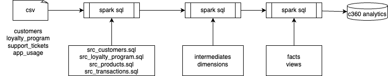
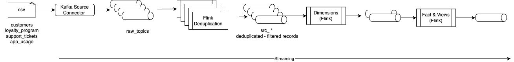

# Flink Project Demonstrations

This project includes one Spark project to illustrate batch processing to build a customer 360 analytic data product. The high level architecture of this demonstration is:

From this project we will shift left by moving the batch-based Spark processing to a real-time processing with Kafka and Flink project:

The project also demonstrates an automatic migration from Spark to Flink using the [shift_left tool](https://jbcodeforce.github.io/shift_left_utils/coding/llm_based_translation/) and agentic AI.

Finally other Flink projects are also includes to demonstrate smaller use cases.

## A data as a product design

The specific use case is a multi-channel retailer (bricks-and-mortar stores, e-commerce, mobile app) migrating their analytics platform to an Analytics Lakehouse with real-time processing.

The project identifies the key business domains and assigning the following ownership:

| Domain	|Data Owner/Team	|Key Data Sources|
| --- | --- | --- |
| **Customer**	| Customer Experience/CRM Team	| CRM system, loyalty program, support tickets, app usage logs |
| **Sales**	| Finance/Sales Operations Team	 |Point of Sale (POS) system, e-commerce transactions, regional sales ledgers |
| **Product** |	Merchandising Team	| Product catalog, inventory system, supplier data |
| **Logistics**	| Supply Chain Team	| Warehouse management, shipping manifests, tracking data |

The Customer Domain Team is responsible for building a core data product named, the **Customer 360 Data Product**.

| Metadata | Description | 
| --- | --- | 
| **Product Name:** | customer.analytics.C360 |
| **Purpose:** | To provide a comprehensive, high-quality, and up-to-date view of a customer for analytics, BI, and ML initiatives across all other domains. |
| **Data Storage:** | Uses the Lakehouse's object storage in an open format (e.g. Iceberg tables) for ACID-compliant, performant data.|
| **Ingestion:** | Real-time are managed by the Customer Domain Team to ingest and transform raw data from source systems into the Lakehouse. |

#### Data Product Output:

The final curated data is exposed via well-defined, easily consumable interfaces: 

* **SQL Endpoint:** A materialized view or table on the Lakehouse that other domains can query directly using SQL.
* **API Service:** A REST API for low-latency, record-by-record lookups (e.g., for a personalized recommendation service).
* **File Export:** Secure, versioned file exports for large-scale ML model training.

#### Data Product Characteristics:

* **Discoverable:** Registered in a central Data Catalog (a self-service component of the Mesh).
* **Addressable:** Has a unique identifier and clear documentation (customer.analytics.C360).
* **Trustworthy:** Includes built-in data quality checks (DQ) and validation rules enforced by the Customer Team.
* **Self-Describing:** Contains rich, up-to-date metadata (schema, lineage, ownership, DQ metrics).
* **Secure & Governed:** Access is controlled using federated governance rules (e.g., fine-grained, tag-based access control on the Lakehouse).

#### Cross-Domain Consumption for Analytics

Other domains then consume this product to achieve their analytical goals:

| Consuming Domain | Analytical Goal |Data Product Consumed
| --- | --- | --- |
| **Marketing**	| Predict churn for a targeted email campaign. |	customer.analytics.Customer360Profile (to get demographics, loyalty score, purchase history).|
| **Product** |	Analyze which customer segments are buying a new line of shoes. | customer.analytics.Customer360Profile joined with the Sales Domain's sales.transaction.AggregatedDailySales product.|
| **Finance** |	Calculate the Customer Lifetime Value (CLV) |	Queries the customer.analytics.Customer360Profile via the SQL endpoint. |

[To read more about moving from DDD to Data as a product methodology see this chapter](https://jbcodeforce.github.io/flink-studies/methodology/data_as_a_product/).

## Flink Project Demos - Folder Structure

* **c360_*** are a set of projects to demonstrate how to define a data as a product in Spark and its equivalent for real time processing in Flink SQL.
    * **c360_spark_processing** a batch implementation using the `star schema` and Kimball method to organize facts, and dimensions. The project [description is here.](./c360/spark_project.md). This project was created using `shift_left project init c360_spark_processing` command.
    * **c360_mock_data**: a set of CSV files to create synthetic data.
    * **c360_api**: A FastAPI-based REST API that exposes Customer 360 analytics for Marketing, Product, and Finance teams built on top of Spark data pipeline.
    * **c360_flink_processing**: Building the same data as a product with Flink processing.
* **flink_data_products** includes a set of small data as a product examples implemented using Flink SQL. They are used to demonstrate pipeline management with [shift_left tool](https://jbcodeforce.github.io/shift_left_utils/pipeline_mgr/) and simplest use cases.

    * the saleops is a simple example of Kimball structure for a star schema about revenu computation in the context of sales of products within different channels (See the [readme](https://github.com/jbcodeforce/flink_project_demos/tree/main/flink_data_products/pipelines/facts/saleops/fct_revenu/readme.md) for details). 

* Ksql project: a set of files to be used for testing automatic migration from ksql.

To Be continued....
